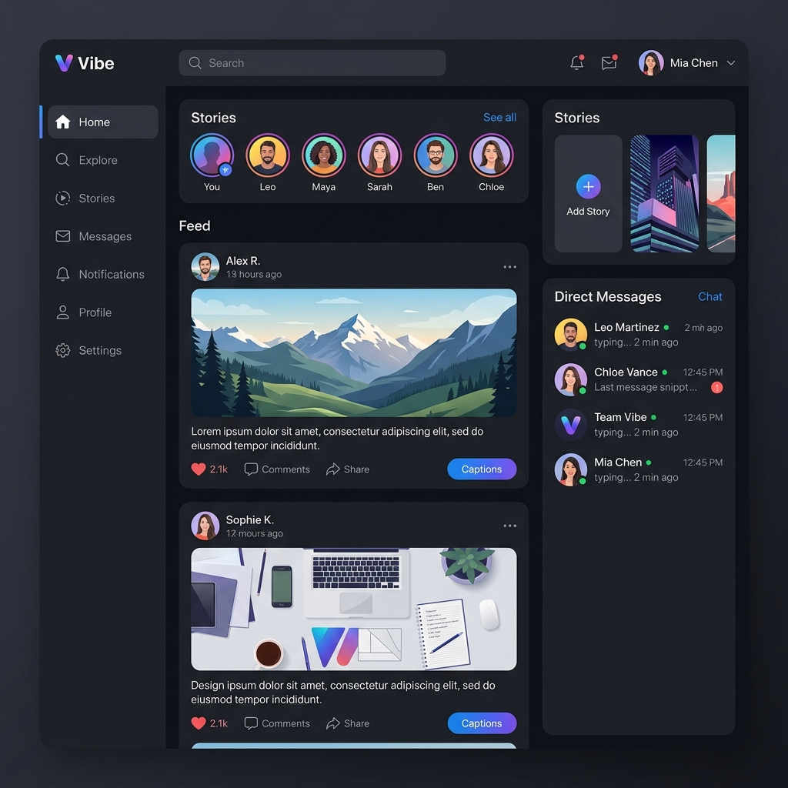

# 📸 Instagram Clone - Real-Time Social Media Platform

[](https://vite.dev/)
[](https://react.dev/)
[](https://tailwindcss.com/)
[](https://nodejs.org/)
[](https://www.mongodb.com/)
[](https://socket.io/)

A full-stack, high-performance Instagram clone featuring real-time messaging, user activity tracking, multimedia posts creation, dynamic interactions, and natively integrated WebRTC voice/video calls.

---

## 🔗 Live Links
- **Live Demo (Frontend)**: [social-app-lac.vercel.app](https://social-app-lac.vercel.app)
- **Live API Backend**: [dipanshu-instagram.onrender.com](https://dipanshu-instagram.onrender.com/login)

---

## 🖥️ Application Preview



---

## 🌟 Key Features

- **📸 Interactive Feed & Media**: 
  - Create posts with image uploads, captions, and tags.
  - Interactive features: Like, dislike, comment on, and bookmark posts.
  - Real-time notifications for user interactions.
- **💬 Real-Time Direct Messaging**: 
  - Dynamic chat system powered by **Socket.io**.
  - Live online/offline status tracking and instant presence updates.
- **📞 WebRTC Voice & Video Calls**: 
  - Launch audio/video calls natively from direct message headers using `RTCPeerConnection`.
  - Responsive picture-in-picture window overlay for multi-tasking.
- **👥 Social Relationships**: 
  - Robust follow and unfollow system to build a network.
- **⚙️ Dynamic User Profiles**: 
  - Edit profiles (avatar uploads integrated via **Cloudinary**, bio updates).
  - Clean layout displaying the user's posts, followers, and followings.

---

## 🛠️ Tech Stack

### Frontend
- **Framework**: React.js (Vite builder)
- **State Management**: Redux Toolkit & Redux Persist
- **Styling**: Tailwind CSS & Lucide Icons
- **Real-Time Communication**: Socket.io-client & native WebRTC API

### Backend
- **Runtime**: Node.js & Express.js
- **Database**: MongoDB & Mongoose
- **Asset Storage**: Cloudinary (Image hosting) & Multer (Multipart parsing)
- **Security & Session**: JWT (JSON Web Tokens), bcryptjs, and cookie-parser (Secure cross-origin cookies)

---

## 📁 Project Structure

```text
dipanshu-instagram/
├── frontend/             # React (Vite) Frontend Application
│   ├── public/           # Static assets
│   └── src/              # React components, hooks, redux slices, and pages
└── backend/              # Node.js + Express Backend Server
    ├── controllers/      # Request handlers
    ├── models/           # MongoDB schemas
    ├── routes/           # REST API endpoints
    └── socket/           # Socket.io connection and WebRTC event handlers
```

---

## 🚀 Local Installation & Setup

### Prerequisites
- [Node.js](https://nodejs.org/) installed
- [MongoDB](https://www.mongodb.com/) account/database local or remote

### Step 1: Clone the Repository
```bash
git clone https://github.com/DIPANSHU66/dipanshu-instagram.git
cd dipanshu-instagram
```

### Step 2: Configure & Start Backend
1. Navigate to the `backend` folder and install dependencies:
   ```bash
   cd backend
   npm install
   ```
2. Create a `.env` file in the `backend/` directory:
   ```env
   PORT=8000
   MONGO_URL=your_mongodb_connection_string
   SECRET_KEY=your_jwt_secret_key
   CLOUD_NAME=your_cloudinary_cloud_name
   API_KEY=your_cloudinary_api_key
   API_SECRET=your_cloudinary_api_secret
   URL=http://localhost:5173
   ```
3. Start the backend development server:
   ```bash
   npm run dev
   ```

### Step 3: Configure & Start Frontend
1. Navigate to the `frontend` folder and install dependencies:
   ```bash
   cd ../frontend
   npm install
   ```
2. Create a `.env` file in the `frontend/` directory:
   ```env
   VITE_API_URL=http://localhost:8000/api/v1
   ```
3. Start the frontend Vite development server:
   ```bash
   npm run dev
   ```

---

## 🛡️ License & Contributions
This project is open-source. Contributions, issues, and feature requests are welcome!

---

*Made with ❤️ by [Dipanshu Bansal](https://github.com/DIPANSHU66)*
